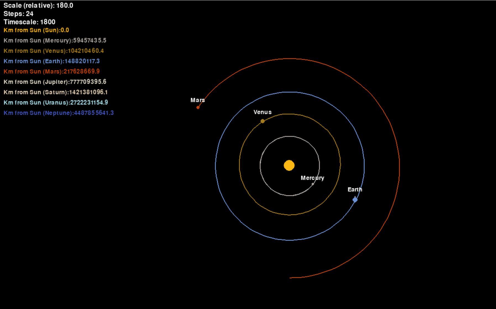
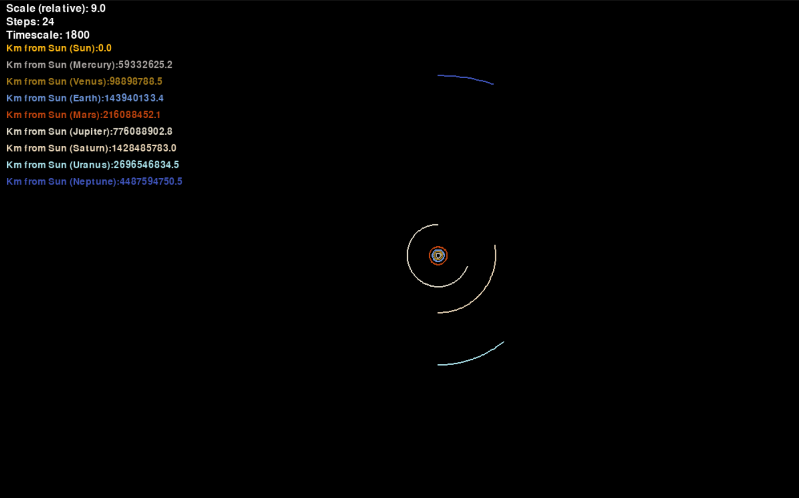

# Improved-Solar-Simulation
I revisited my solar system simulation to make some improvements which I mentioned in the original. I made a new repository because I wanted to keep them separate.

New features include:
    - More planets, no Pluto as Mr Tyson says it is no longer a planet
    - Zooming in and out (Up and Down arrows)
    - Speeding up and slowing down the simulation (Left and Right arrows)
    - Swaping views to different bodies ("A" and "D")
    - Toggling names and orbit lines ("T" and "L" respectively)
    - The ability to add moons (making them have stable orbits is very finiky)

Here are some demo photos:

